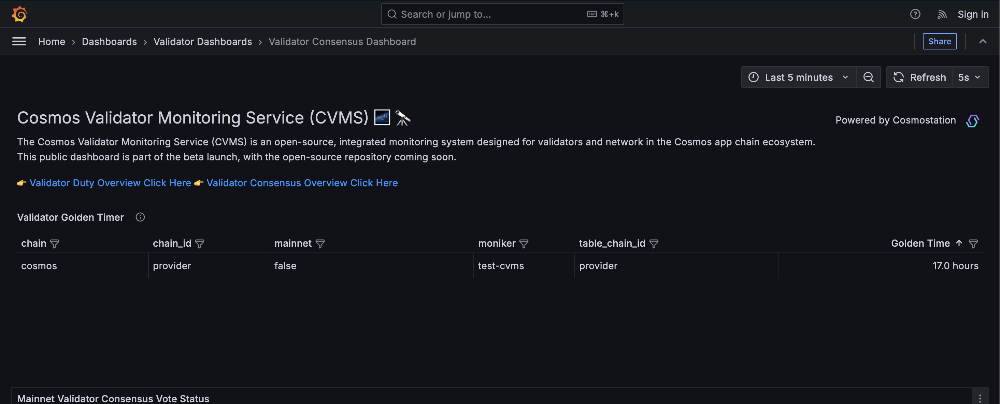

# Testnet Demo Day # 10: 2024-November-27

In this demo day, we'll demonstrate using Cosmostation's [Cosmos Validator Monitoring Service](https://github.com/cosmostation/cvms) (CVMS) to monitor your validator node!
This will consist of two tasks:

1. **No TIP points** Set up a CVMS instance to monitor your validator
2. **1 TIP point** Bring your validator down for 30 minutes to see how CVMS handles downtime

If you don't want to set up your own CVMS, you can [follow this one](http://143.198.42.179:3000/)

We will post announcements in the `testnet-announcements` channel in Discord to coordinate activities during the event.

* Start time: `2024-11-27 15:30 UTC`
* End time: `2024-11-27 18:30 UTC`

## Testnet Incentives Program (TIP) Eligibility

* You'll earn one TIP point if you bring your validator down for 30 minutes

## Tasks


### Task 1: Spin up a CVMS instance

CVMS is a Cosmostation project that runs completely dockerized. A single docker-compose file, will spin up Prometheus exporters, a Prometheus scraper,
an Alertmanager instance, and a Grafana. This section of the guide will
show you how to set up for use with CVMS.

Start by cloning it:

```shell
git clone https://github.com/cosmostation/cvms.git
cd cvms
```

Create two config files inside the `cvms` directory,
`config.yaml` and `.env`.

`config.yaml` will tell CVMS where to find your node. You can use a public
endpoint for this, or you may use a docker-bridged IP address if you are setting up CVMS in the same machine as a node.  To find out
your localhost's address from a bridged docker network, inspect the `docker0`
network interface:

```shell
$ ip addr show docker0

4: docker0: <NO-CARRIER,BROADCAST,MULTICAST,UP> mtu 1500 qdisc noqueue state DOWN group default
    link/ether 02:42:45:88:09:e0 brd ff:ff:ff:ff:ff:ff
    inet 172.17.0.1/16 brd 172.17.255.255 scope global docker0
       valid_lft forever preferred_lft forever
    inet6 fe80::42:45ff:fe88:9e0/64 scope link proto kernel_ll
       valid_lft forever preferred_lft forever
```

See the `172.17.0.1` in the output? That's our machine's local address as reachable from the
docker network. You can use this in your `config.yaml`. Make sure you also fill in your validator
moniker!

`config.yaml`
```yaml
# Set your moniker here
monikers: ['test-cvms']

chains:
  - display_name: 'provider'
    chain_id: provider
    # You may track an address' balance by filling in tracking_addresses
    tracking_addresses:
      - 'cosmos1eawa5lpg7283jxyyx006etqg9fm6grx9zuz6lk'
    # Your node goes here. Use the above docker-bridge IP or a public endpoint
    nodes:
      - rpc: 'http://172.17.0.1:26657'
        api: 'http://172.17.0.1:1317'
        grpc: '172.17.0.1:9090'
      # Let's also add the public sentry to make sure we get metrics if your node goes down.
      - rpc: 'https://rpc.provider-sentry-01.rs-testnet.polypore.xyz'
        api: 'https://rest.provider-sentry-01.rs-testnet.polypore.xyz'
        grpc: 'rpc.provider-sentry-01.rs-testnet.polypore.xyz:9090'

```

Next you'll create `.env`. This'll configure publicly-accessible endpoints
for your CVMS instance. In particular, you probably want `PROM_SERVER_PORT`
to be set to something other than the default of `9090`:

`.env`
```bash
###### CVMS Services #######
# EXPORTER_PORT=9200
# INDEXER_PORT=9300
# LOG_COLOR_DISABLE=false
# LOG_LEVEL=4
# CONFIG_PATH=./config.yaml
# DB_RETENTION_PERIOD=1h

####### Prometheus Service #######
PROM_SERVER_PORT=9091
# PROM_CONFIG_FILE=custom-prometheus.yml
# PROM_RETENTION_TIME=1m

####### Postgres Service #######
# DB_HOST=localhost
# DB_PORT=5432
# DB_NAME=cvms
# DB_USER=cvms
# DB_PASSWORD=mysecretpassword


####### Grafana Service #######
#ADMIN_USER=admin
#ADMIN_PASSWORD=admin
#GRAFANA_HOME_DASHBOARD=/etc/grafana/provisioning/dashboards/network/network-status-dashboard.json
#GRAFANA_SERVER_PORT=3000

####### Alertmanager Service #######
#ALERTMANAGER_SERVER_PORT=9093
```

You may now start your CVMS instance by running:

```shell
docker compose up
```

If everything went well, you should end up seeing messages from the `cvms-indexer` and `cvms-exporter` services.
* You can now reach the Grafana dashboards at `http://your.nodes.address:3000/dashboards`
* Try looking at the `Validator Consensus Dashboard`. It should look like this:



The Golden Time defines how long your validator can be down before you get jailed.
Let's mess with it.

### Task 2: Bring your validator down for half an hour

Bring your validator down.
* You will not be jailed for downtime unless you leave it down for more than 16 hours.

Now look at the Golden Timer in CVMS. You can use [this one](http://143.198.42.179:3000/d/be0fqrlk919moe/validator-consensus-dashboard?from=now-5m&to=now&timezone=browser&refresh=5s) if need be. Do you see how it's going down for your validator? This would be a great metric to alert on!

After your validator has been down for 30 minutes, bring it back up, and watch that Golden Timer go back up.
